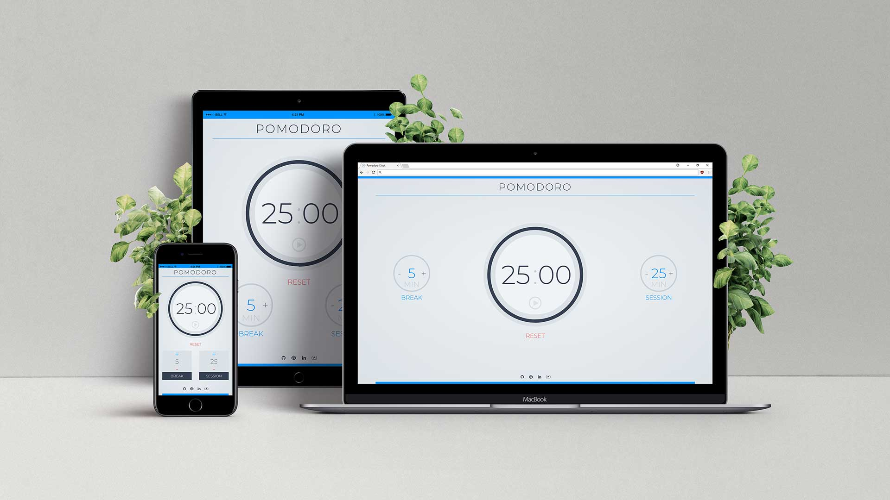

# A PWA Pomodoro Clock | FCC Project

A *FreeCodeCamp* challenge on using JavaScript to build a Pomodoro Clock with the below user stories to be fulfilled:

> 1. I can start a 25 minute pomodoro, and the timer will go off once 25 minutes has elapsed.
> 2. I can reset the clock for my next pomodoro.
> 3. I can customize the length of each pomodoro.

#### More about the challenge [Build a Pomodoro Clock](https://www.freecodecamp.org/challenges/build-a-pomodoro-clock).
#### See it in action [HERE](https://amr-adel.github.io/fcc-pomodoro/).